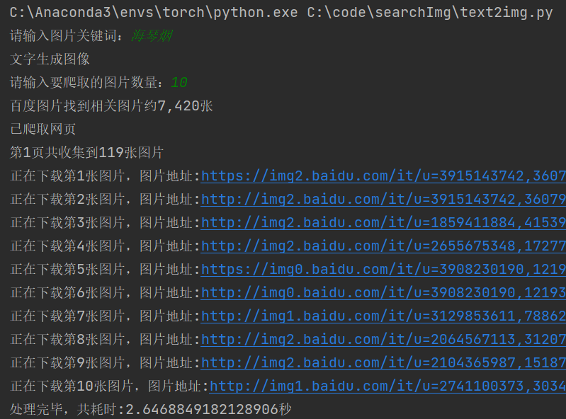

# 基于 CLIP 实现以文精准搜图

利用 CLIP 模型的能力在以文字搜索图片时，进行每张检索到的图片与当前检索文本匹配度权值的生成，进而对匹配度大小进行排序，进而选出最匹配度前 n 张图片

## 原理简介

剔除 CLIP 对我们需求无用的 softmax 层，将模型在上一层的输出提取出来，封装成函数嵌入我们代码的中间步骤中

## CLIP 原理

关键词

- 对比学习

- 预训练模型

基本原理简介

- 为了对 image 和 text 建立联系，首先分别对 image 和 text 进行特征提取，image 特征提取的 backbone 可以是 resnet 系列模型也可以是 VIT 系列模型，<br/>text 特征提取目前一般采用 bert 模型，特征提取之后，由于做了 normalize，直接相乘来计算余弦距离，同一 pair 对的结果趋近于 1，不同 pair 对的结果趋近于 0，<br/>
  因为就可以采用对比损失 loss（info-nce-loss），熟悉这个 loss 的同学应该都清楚，这种计算 loss 方式效果与 batch size 有很大关系，一般需要比较大的 batch size 才能有效果。

- CLIP 能够成功，并且很难自己复现的一个重要原因就是 CLIP 用了大量的训练数据以及训练资源，真的可以说是大力出奇迹。CLIP 用了 4 亿的图像文本对进行训练
  - 基本思路：
    - 编码 ：通过图像&文本编码器，得分图像和文本特征。
    - 投影：首先通过投影矩阵将图像及文本特征映射到相同的维度大小，在进行 L2 normalization （使得之后的点积操作直接等效于 cosine similarity)
    - 相似度计算：点积运算计算文本-图像的 cosine similarity，得到 n x n 矩阵的 logits（模型预测），越接近 1 则说明模型预测该文本-图像对是配对的，否则不配对。
    - 计算 loss：已知 logits 矩阵对角线的文本和图像是配对的，非对角线元素不配对，因此构造训练标签 np.arange(n)，然后分别在图像维度（axis=0) 和文本维度（axis=1）计算 loss。以图像维度为例简单说明一下这里的逻辑，因为在计算相似度的时候，图像特征矩阵@文本特征矩阵得到的 n x n 矩阵，第一个 n 代表的图像，因此我们在 axis=0 计算图像维度的 loss

## CLIP 模型优缺点

### 优点

zero-shot 做得好，经过在 400 million 大的未清洗的数据集上训练，在不同的数据集上表现还可以，可以自定义任务，而且效率很高。
高效，虽然 GPT3 做 zero-shot 也很好，但是 CLIP 吃的资源少，计算量少，训练效率高。最好的一版 CLIP 只在 256 个 GPU 上训练两周就好了，跟目前图像领域的其他大模型都差不多。
灵活和通用：因为他们直接从自然语言中学习广泛的视觉概念，CLIP 明显比现有的 ImageNet 模型更灵活和通用。我们发现他们能够轻松地完成许多不同的任务。

### 缺点

虽然 CLIP 通常在识别普通物体方面表现良好，但在更抽象或更系统的任务上却表现不佳。比如计算图像中物体的数量，以及在更复杂的任务上，比如预测照片中最近的汽车距离有多近。在这两个数据集上，零射剪辑只比随机猜测好一点点。

与特定任务模型相比，Zero-shot CLIP 在非常细粒度的分类上也很困难，比如区分汽车模型、飞机变体或花卉种类之间的区别。
对于未包含在其预训练数据集中的图像，CLIP 的泛化效果也很差。例如，尽管 CLIP 学习了一个有效的 OCR 系统，但当从 MNIST 数据集评估手写数字时，zero-shot CLIP 仅达到 88%的准确率，远低于数据集上 99.75%的人的准确率。（其实还行，毕竟不是专门在 MNIST 上跑的）

## 使用方法

### 软件

- Anaconda

- IDE 推荐 Pycharm

### 环境依赖

- 见 requirements.txt

### 安装

参考 CLIP 模型的安装方法

- 在下载速度慢时建议使用镜像源

```bash
$ pip install -r requirements.txt
```

下载慢的话建议使用镜像源

### 使用步骤

- 运行 text2img.py 即可



- 注释写的比较详细

## TODO

- 之前用 Pyqt5 写了个 GUI，等我有空找一找更新一下
- 基于 CLIP 针对特定的应用场景进行迁移学习来提高准确度
